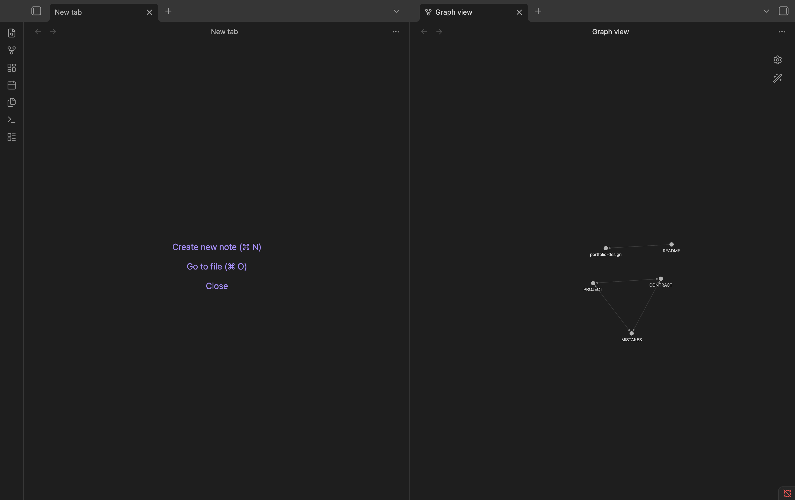
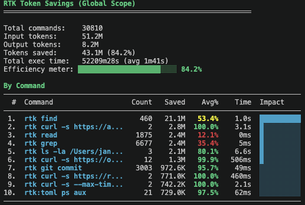

# basecamp

  

A production-ready Claude Code setup. Global CLAUDE.md, coding rules, per-project memory, and token optimization.

## Quick Start

```bash
git clone https://github.com/janmaaarc/basecamp.git
cd basecamp
bash setup.sh ~/Documents/your-vault
```

Then open `~/.claude/CLAUDE.md`, fill in your stack, and follow [Setup](#setup) for tools and plugins.

## What This Is

This is the exact setup I use daily. Not a template made for show. A working system built and refined through real projects.

Most Claude Code setups are minimal. This one is not. It covers:

- Global instructions Claude follows on every project
- Karpathy coding principles (think before coding, surgical changes)
- Commit, branch, and PR conventions
- Per-project memory via Obsidian (PROJECT, MISTAKES, CONTRACT files)
- Token optimization via RTK and Headroom
- Safety hooks (block dangerous commands, scan secrets)
- Persistent memory across sessions via claude-mem

## Screenshots

**Obsidian graph view (PROJECT, MISTAKES, CONTRACT linked)**



**RTK token savings**



## Video Walkthrough

> Coming soon. Full setup walkthrough covering: clone, setup.sh, filling in CLAUDE.md, Obsidian graph view, and token savings demo.

## Requirements

- macOS (Linux partially supported, Windows not tested)
- [Claude Code](https://claude.ai/code)
- [Obsidian](https://obsidian.md) (free) — for per-project memory files
- Homebrew — for RTK
- Python 3.10+ — for Headroom
- Node.js 18+ — for claude-mem

## Setup

### 1. Run setup script

```bash
bash setup.sh ~/Documents/your-vault
```

This copies all files to `~/.claude/` and your Obsidian vault. Or do it manually:

```bash
mkdir -p ~/.claude/rules
cp CLAUDE.md ~/.claude/CLAUDE.md
cp RTK.md ~/.claude/RTK.md
cp -r rules/ ~/.claude/rules/
cp -r Templates/ ~/Documents/your-vault/Templates/
```

### 2. Update CLAUDE.md

- Open `~/.claude/CLAUDE.md` and fill in your stack, vault path, and defaults
- See `CLAUDE.example.md` for a filled-in reference
- Optional: import stack-specific rules with `@rules/ai-agents.md`, `@rules/web.md`, or `@rules/data.md`

### 3. Install tools

**RTK (token savings 60-90%):**
```bash
brew tap rtk-ai/tap && brew trust rtk-ai/tap && brew install rtk
```

**Headroom (context compression):**
```bash
pip3 install "headroom-ai[proxy]"
headroom install apply
echo 'export ANTHROPIC_BASE_URL=http://127.0.0.1:8787' >> ~/.zshrc
headroom mcp install
```

**claude-mem (persistent memory):**
```bash
npx claude-mem install
echo '(npx claude-mem start &>/dev/null &)' >> ~/.zshrc
```

### 4. Install Claude Code plugins

**Core (recommended for everyone):**
```bash
# ECC — agents, skills, hooks
claude plugin marketplace add affaan-m/ECC
claude plugin install ecc@ecc

# Caveman — terse responses
claude plugin marketplace add JuliusBrussee/caveman
claude plugin install caveman@caveman

# Ponytail — YAGNI coding rules
claude plugin marketplace add DietrichGebert/ponytail
claude plugin install ponytail@ponytail

# Safety hooks — block dangerous commands, scan secrets
claude plugin marketplace add poshan0126/dotclaude
claude plugin install safety-hooks@dotclaude
```

**Optional (install what fits your stack):**
```bash
# n8n workflow skills
claude plugin marketplace add czlonkowski/n8n-skills
claude plugin install n8n-mcp-skills@n8n-mcp-skills

# PostgreSQL skills
claude plugin marketplace add timescale/pg-aiguide
claude plugin install pg@aiguide
```

## How It Works

### Per-Project Memory

Every project gets a folder in your Obsidian vault:

```
your-vault/
  Projects/
    my-app/
      PROJECT.md     <- what the project is, current status
      MISTAKES.md    <- recurring mistakes to avoid
      CONTRACT.md    <- plan for high-risk changes
  Templates/
    PROJECT.md
    MISTAKES.md
    CONTRACT.md
```

Claude reads these at session start automatically. Update `PROJECT.md` at end of each session (max 30 lines, current status only).

### High-Risk Changes

For schema migrations, auth changes, major refactors:

1. Claude researches first. No implementation yet.
2. Claude creates `CONTRACT.md` with plan, risks, rollback.
3. Claude asks clarifying questions.
4. You approve.
5. Claude implements.
6. You verify.

### Token Optimization

- **RTK**: Filters noisy bash/git/grep output before it hits Claude. 60-90% token savings on commands.
- **Headroom**: Compresses tool outputs (file reads, search results) before they reach Claude.
- **claude-mem**: Injects only relevant past context per session. No full history bloat.
- **Caveman and Ponytail**: Keeps responses and code minimal.

## Tools Used

| Tool | Purpose | Repo | License |
|------|---------|------|---------|
| RTK | Token-optimized CLI proxy | [rtk-ai/rtk](https://github.com/rtk-ai/rtk) | Apache 2.0 |
| Headroom | Context compression proxy | [headroomlabs-ai/headroom](https://github.com/headroomlabs-ai/headroom) | Apache 2.0 |
| ECC | Agents, skills, hooks | [affaan-m/ECC](https://github.com/affaan-m/ECC) | MIT |
| Caveman | Terse response mode | [JuliusBrussee/caveman](https://github.com/JuliusBrussee/caveman) | MIT |
| Ponytail | YAGNI coding rules | [DietrichGebert/ponytail](https://github.com/DietrichGebert/ponytail) | MIT |
| claude-mem | Persistent session memory | [thedotmack/claude-mem](https://github.com/thedotmack/claude-mem) | Apache 2.0 |
| safety-hooks | Block dangerous commands, scan secrets | [poshan0126/dotclaude](https://github.com/poshan0126/dotclaude) | MIT |
| n8n-mcp-skills | n8n workflow skills (optional) | [czlonkowski/n8n-skills](https://github.com/czlonkowski/n8n-skills) | MIT |
| pg-aiguide | PostgreSQL skills (optional) | [timescale/pg-aiguide](https://github.com/timescale/pg-aiguide) | Apache 2.0 |

## Maintenance

```bash
# Update plugins
claude plugin marketplace update ecc
claude plugin marketplace update caveman
claude plugin marketplace update ponytail
claude plugin marketplace update dotclaude

# Update tools
brew upgrade rtk
headroom update
npx claude-mem update
```

## License

MIT
